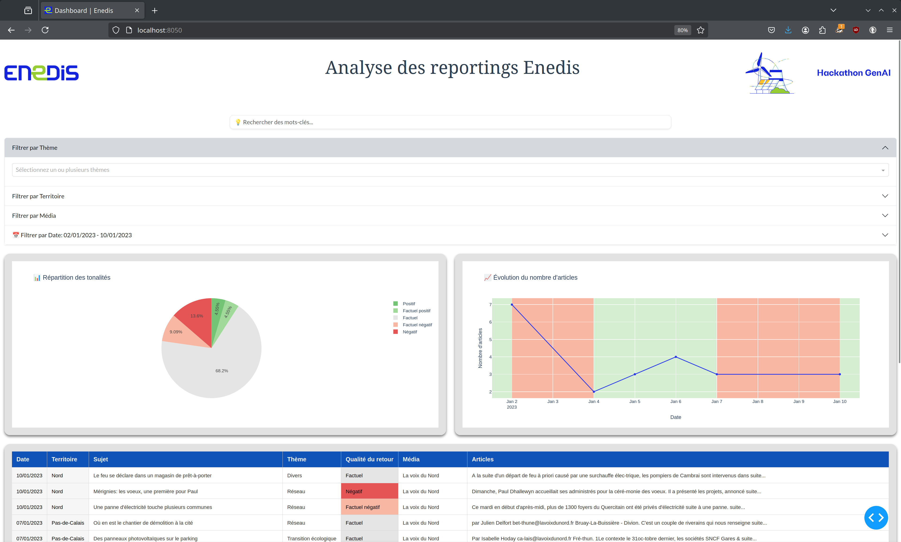

# Data Visualization Dashboard



This project provides an interactive web-based dashboard to analyze Enedis reporting data using Python, Dash, and Plotly.

## Features
- Keyword search functionality
- Filtering options by theme, territory, media, and date range
- Interactive visualizations, including pie charts and time-series graphs
- Tabular data display with pagination

## Prerequisites
Make sure you have Python 3 installed on your system.

## Installation

1. Install required dependencies:
   ```bash
   pip install -r requirements.txt
   ```

2. Ensure the necessary data files are present in the `data/` directory.

## Usage

To run the application, execute the following command:
```bash
python3 app.py
```

Once the application is running, open your web browser and navigate to:
```
http://127.0.0.1:8050
```

## Project Structure
```
.
├── app.py                    # Main application script
├── data/                     # Folder for CSV data files
├── assets/                   # Static assets (e.g., logos, styles)
├── utils/                    # Utility scripts
│   ├── load_and_clean_df.py    # data loading and cleaning functions
│   ├── dash_display.py         # functions to generate Dash components
├── requirements.txt          # Project dependencies
└── README.md                 # Project documentation
```

## Configuration
The application can be configured by modifying the following variables in `app.py`:
- `DASH_APP_URL`: Set the host (default: `localhost`)
- `DASH_APP_PORT`: Set the port (default: `8050`)
