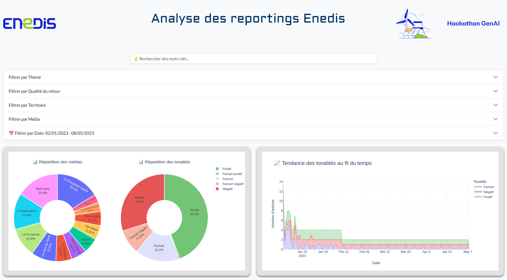

# Data Visualization Dashboard




This project provides an interactive web-based dashboard to analyze Enedis reporting data using Python, Dash, and Plotly.

## Features
- **Keyword search functionality**: Search for specific keywords in the dataset.
- **Filtering options**: Filter data by theme, territory, media, and date range.
- **Interactive visualizations**:
  - Combined pie charts for sentiment and media distribution.
  - Sentiment trend chart.
  - Word cloud for text analysis.
  - Geographic distribution map.
- **Tabular data display**: View filtered data in a paginated table.

## Prerequisites
Make sure you have **Python 3** installed on your system.

## Installation

1. Clone the repository:
   ```bash
   git clone <repository-url>
   cd <repository-folder>
   ```

2. Install required dependencies:
   ```bash
   pip install -r requirements.txt
   ```

3. Download NLTK stopwords (required for the word cloud):
   ```bash
   python -c "import nltk; nltk.download('stopwords')"
   ```

4. Ensure the necessary data files are present in the `data/` directory.

## Usage

To run the application, execute the following command:
```bash
python3 app.py
```

Once the application is running, open your web browser and navigate to:
```
http://localhost:8050
```

## Project Structure
```
.
├── app.py                    # Main application script
├── data/                     # Folder for CSV data files
├── assets/                   # Static assets (e.g., logos, styles, GeoJSON)
│   ├── css/                  # Custom CSS styles
│   ├── img/                  # Images (logos, icons)
│   └── geojson/              # GeoJSON files for geographic distribution
├── utils/                    # Utility scripts
│   ├── load_and_clean_df.py  # Data loading and cleaning functions
│   └── dash/                 # Dash-specific utility functions
├── requirements.txt          # Project dependencies
└── README.md                 # Project documentation
```

## Configuration
The application can be configured by modifying the following variables in `app.py`:
- **`DASH_APP_URL`**: Set the host (default: `localhost`).
- **`DASH_APP_PORT`**: Set the port (default: `8050`).
- **`DATA_GRID`**: Customize the layout of the dashboard by rearranging or adding/removing visualizations. Available options:
  - `combined-pie-chart`
  - `sentiment-trend-line`
  - `sentiment-trend-area`
  - `word-cloud`
  - `geographic-distribution`

Example:
```python
DATA_GRID = [
    ['combined-pie-chart', 'sentiment-trend-area'],
    ['word-cloud', 'geographic-distribution'],
]
```

## Notes
- The dashboard uses **Dash** for the web framework and **Plotly** for visualizations.
- The word cloud requires NLTK's French stopwords, which are downloaded automatically during setup.
- The geographic distribution map uses a GeoJSON file (`france-departements.geojson`) for rendering.
